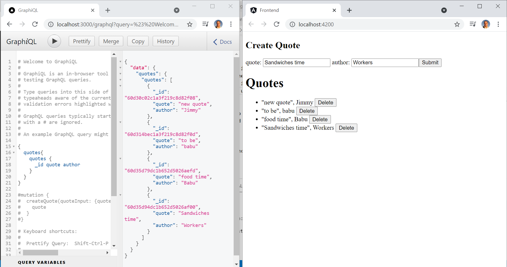

# :zap: MEAN GraphQL CRUD

* A MongoDB Express Angular Node.js (MEAN) full-stack app using Apollo and GraphQL to get data from a MongoDB database.
* **Note:** to open web links in a new window use: _ctrl+click on link_


## :page_facing_up: Table of contents

* [:zap: Next API Data](#zap-next-api-data)
  * [:page_facing_up: Table of contents](#page_facing_up-table-of-contents)
  * [:books: General Info](#books-general-info)
  * [:camera: Screenshots](#camera-screenshots)
  * [:signal_strength: Technologies](#signal_strength-technologies)
  * [:floppy_disk: Setup](#floppy_disk-setup)
  * [:computer: Code Examples](#computer-code-examples)
  * [:clipboard: Status & To-Do List](#clipboard-status--to-do-list)
  * [:clap: Inspiration](#clap-inspiration)
  * [:file_folder: License](#file_folder-license)
  * [:envelope: Contact](#envelope-contact)

## :books: General Info

* Very basic Angular front-end where user can create read and delete database records with fields: name, quotation & an ID automatically assigned
* From `http://localhost:3000/graphql` GraphQL can be used to query (GET) and mutate (POST, PUT, DELETE etc.) database records. Records can only be edited from here (i.e. not from the Angular frontend)
* MongoDB Atlas backend database
* Data is passed using GraphQL and Apollo using [Apollo-Angular HTTP](https://apollo-angular.com/docs/data/network)

## :camera: Screenshots

.

## :signal_strength: Technologies

* [Node.js v16](https://nodejs.org/) javascript runtime using the [Chrome V8 engine](https://v8.dev/)

* [Angular v13](https://angular.io/) frontend
* [GraphQL v16](https://github.com/graphql/graphql-js)
* [Apollo v3](https://www.apollographql.com/) GraphQL implementation data graph layer
* [Apollo Client v3](https://www.npmjs.com/package/apollo-client) caching GraphQL client to UI components can fetch data via GraphQL. More documentation [here](https://apollographql.com/docs/react/).
* [Apollo Angular v3](https://www.npmjs.com/package/apollo-angular) caching GraphQL server. [Website](https://apollo-angular.com/)

## :floppy_disk: Setup

**Backend**
* From `/backend` run `npm i` to install dependencies
* Create `backend/config.json` then add database access credentials - see `config.example.json`
* `npm run start` to run the backend in dev. mode. Open [http://localhost:3000](http://localhost:3000) to view it in the browser. Restarts itself if code updated

**Frontend**
* From `/frontend` run `npm i` to install dependencies
* `npm run start` to run frontend in dev. mode.

## :computer: Code Examples

* `backend/graphql/resolvers` function to return an array of quotes with id using the map function

```javascript
	quotes: async function () {
		const quotes = await Quote.find();
		return {
			quotes: quotes.map((q) => {
				return {
					...q._doc,
					_id: q._id.toString(),
				};
			}),
		};
	},
```

## :clipboard: Status & To-Do List

* Status: Part-working. Backend connects, Frontend error: `ERROR Error: Http failure response for https://48p1r2roz4.sse.codesandbox.io/:`
* To-Do: Add edit to frontend. Add styles

## :clap: Inspiration

* [Jon Peppinck: Angular GraphQL MEAN Apollo CRUD API](https://www.youtube.com/watch?v=zCMNvnlDoVg)

## :file_folder: License

* N/A

## :envelope: Contact

* Repo created by [ABateman](https://github.com/AndrewJBateman), email: gomezbateman@yahoo.com
